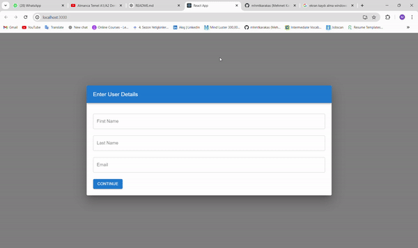

# Multi-Step Form with Material-UI

 This project implements a multi-step form using React and Material-UI. The form is designed to collect information in sequential steps, guiding users through each section for a seamless data entry experience.

 ### Technologies Used

  + __React__: Used for building the user interface and managing state.

  + __Material-UI__: Provides pre-styled components and themes for a modern design.

  + __Form Validation__: Implemented using built-in React validation

  ### Implementation Details

  1. Stepper Component:

   + Material-UI's Stepper component is utilized to visualize the steps of the form.
   + Each step is represented by a Step component, indicating the current step the user is on.

  2. Form Components:

   + Each step of the form is a separate component, containing form fields and validation logic.
   + Material-UI components such as TextField for input elements.

  3. State Management

   + State management can be handled using React's useState hook to manage form data within each component.
   
   